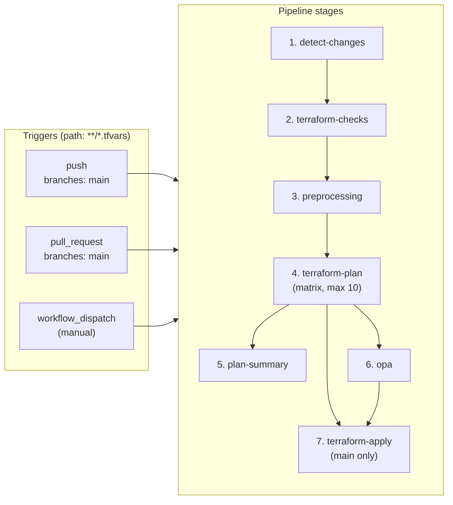
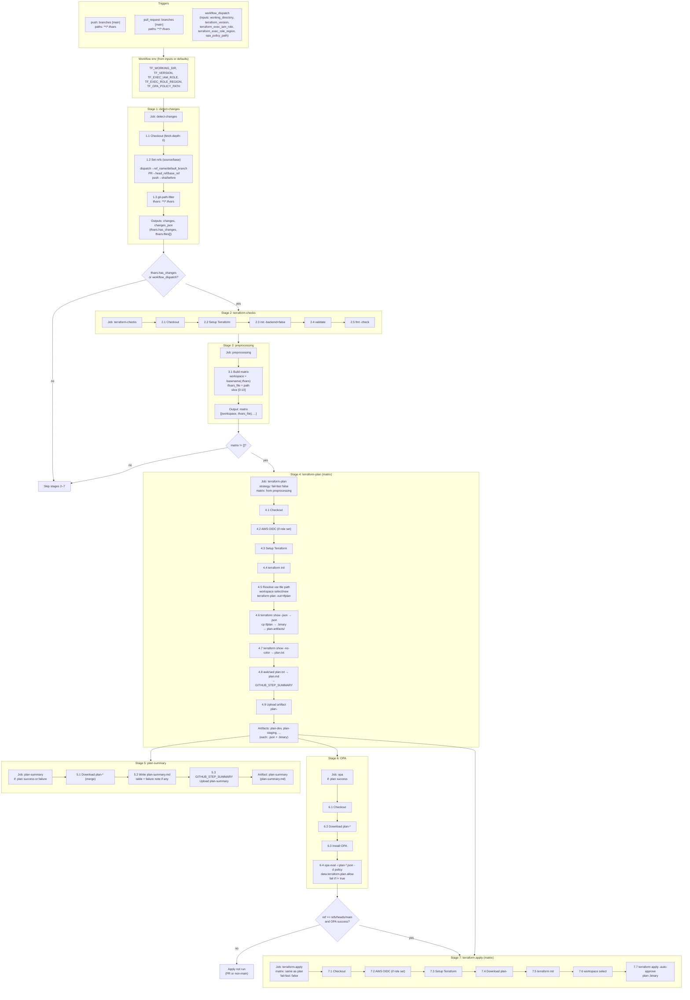
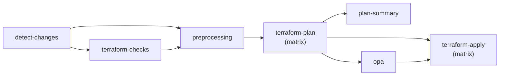
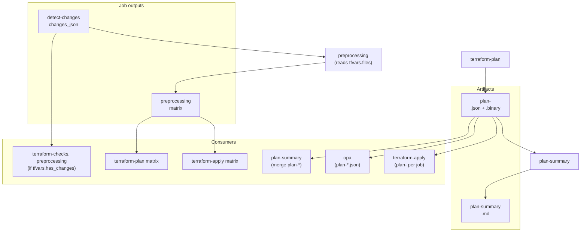

# Terraform workflow — architecture and diagrams

This document describes the Terraform CI/CD workflow with diagrams that show triggers, stages, job dependencies, conditions, inputs, outputs, and artifacts. Reading the diagrams should convey the full design.

---

## 1. Trigger and pipeline overview

**Takeaways:** Three triggers; seven stages; apply (7) runs only after OPA (6) and only on main.

---

## 2. Full workflow (triggers, conditions, jobs, artifacts)

**Takeaways:** One diagram shows triggers, env, all seven stages, step numbers, outputs/artifacts, and conditions (tfvars changed, matrix non-empty, ref=main + OPA success).

---

## 3. Job dependency graph

**Takeaways:** Linear chain 1→2→3→4; then 4 feeds 5, 6, and 7; 6 also feeds 7.

---

## 4. Data flow (outputs and artifacts)

**Takeaways:** `changes_json` drives preprocessing; `matrix` drives plan and apply; plan artifacts feed summary, OPA, and apply.

---

## 5. Trigger → outcome matrix

```mermaid
flowchart TB
  subgraph FEATURE["Feature branch"]
    F1["Push"]
    F2["No auto-trigger"]
    F3["Run workflow (manual)"]
    F1 -.-> F2
    F2 --> F3
    F3 --> F4["Plan runs (stages 1–6)\nApply skipped (not main)"]
  end

  subgraph PR["Pull request to main"]
    PR1["Open/update PR"]
    PR2["Auto-trigger (path filter)"]
    PR3["Stages 1–6 run"]
    PR4["Apply skipped"]
    PR5["Merge only if Terraform check passes"]
    PR1 --> PR2 --> PR3 --> PR4 --> PR5
  end

  subgraph MAIN["Merge to main"]
    M1["Merge PR"]
    M2["Push event to main"]
    M3["Auto-trigger"]
    M4["Stages 1–7 run\nApply runs (matrix)"]
    M1 --> M2 --> M3 --> M4
  end
```

**Takeaways:** Feature branch = manual run, plan only. PR = auto plan + OPA, no apply; merge = full pipeline including apply.

---

## 6. Stage and step index (reference)

| Stage | Job | Steps |
|-------|-----|-------|
| 1 | detect-changes | 1.1 Checkout, 1.2 Set refs, 1.3 git-path-filter |
| 2 | terraform-checks | 2.1 Checkout, 2.2 Setup Terraform, 2.3 init -backend=false, 2.4 validate, 2.5 fmt -check |
| 3 | preprocessing | 3.1 Build matrix (max 10) |
| 4 | terraform-plan | 4.1 Checkout, 4.2 AWS OIDC, 4.3 Setup Terraform, 4.4 init, 4.5 plan, 4.6 .json/.binary, 4.7 plan.txt, 4.8 summary, 4.9 upload artifact |
| 5 | plan-summary | 5.1 Download plan-*, 5.2 Write summary, 5.3 Upload plan-summary |
| 6 | opa | 6.1 Checkout, 6.2 Download plan-*, 6.3 Install OPA, 6.4 opa eval |
| 7 | terraform-apply | 7.1 Checkout, 7.2 AWS OIDC, 7.3 Setup Terraform, 7.4 Download plan, 7.5 init, 7.6 workspace select, 7.7 apply |

---

## 7. Component and action summary

| Component | Type | Purpose |
|------------|------|---------|
| **terraform.yml** | Workflow | Defines triggers, env, jobs, steps. |
| **devtools-landingzone/actions/git-path-filter** | Composite action | Detects changed files by pattern (tfvars). |
| **devtools-landingzone/policies/terraform** | Rego bundle | OPA policies; default `plan.rego` (allow). |
| **actions/checkout@v4** | Action | Checkout repo. |
| **actions/create-github-app-token@v2** | Action | Create installation token for private Git module repos (when `TF_MODULES_APP_ID` set). |
| **hashicorp/setup-terraform@v3** | Action | Install Terraform. |
| **aws-actions/configure-aws-credentials@v4** | Action | AWS OIDC assume-role. |
| **actions/upload-artifact@v4** | Action | Upload plan-*, plan-summary. |
| **actions/download-artifact@v4** | Action | Download plan-* (merge or by name). |

---

For the detailed README (inputs, env, artifacts, branch protection), see [readme-terraform.md](readme-terraform.md).
