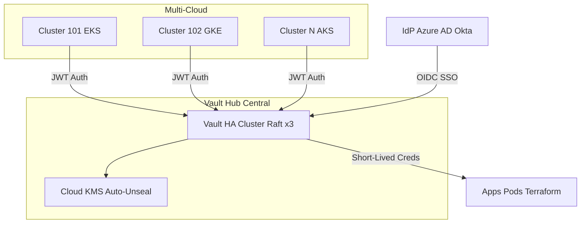
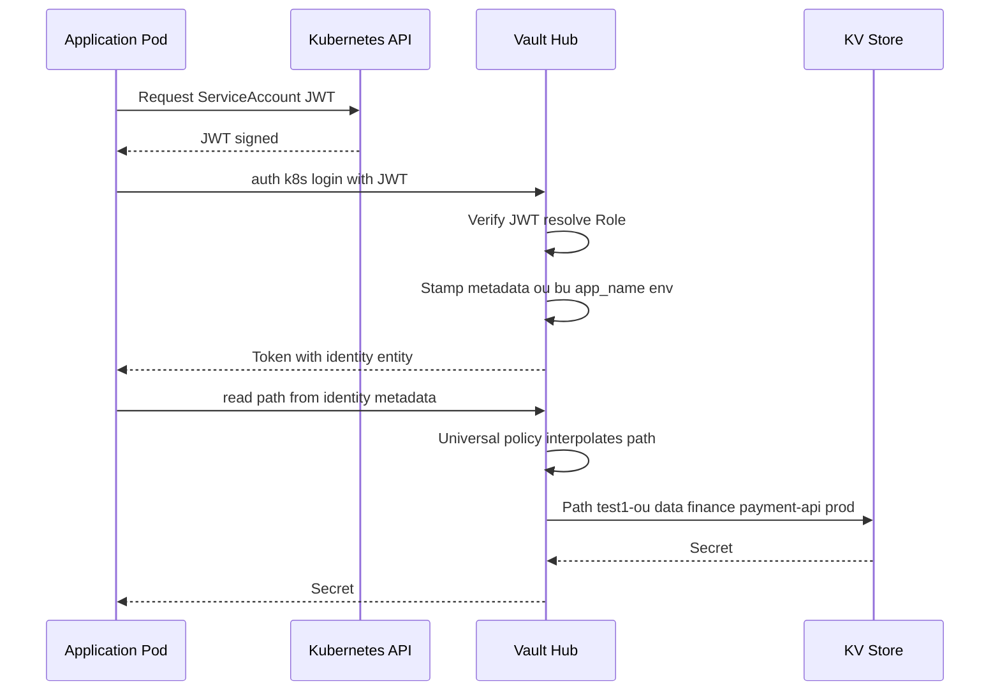
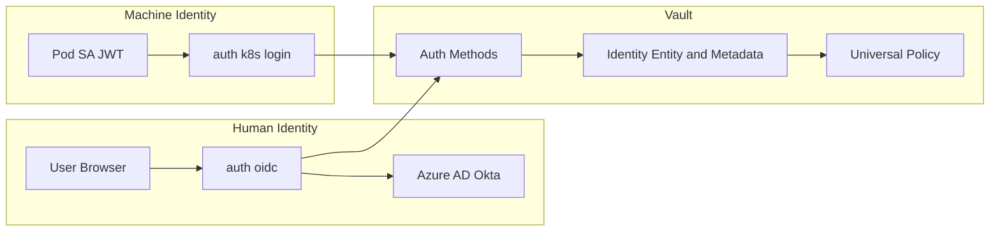
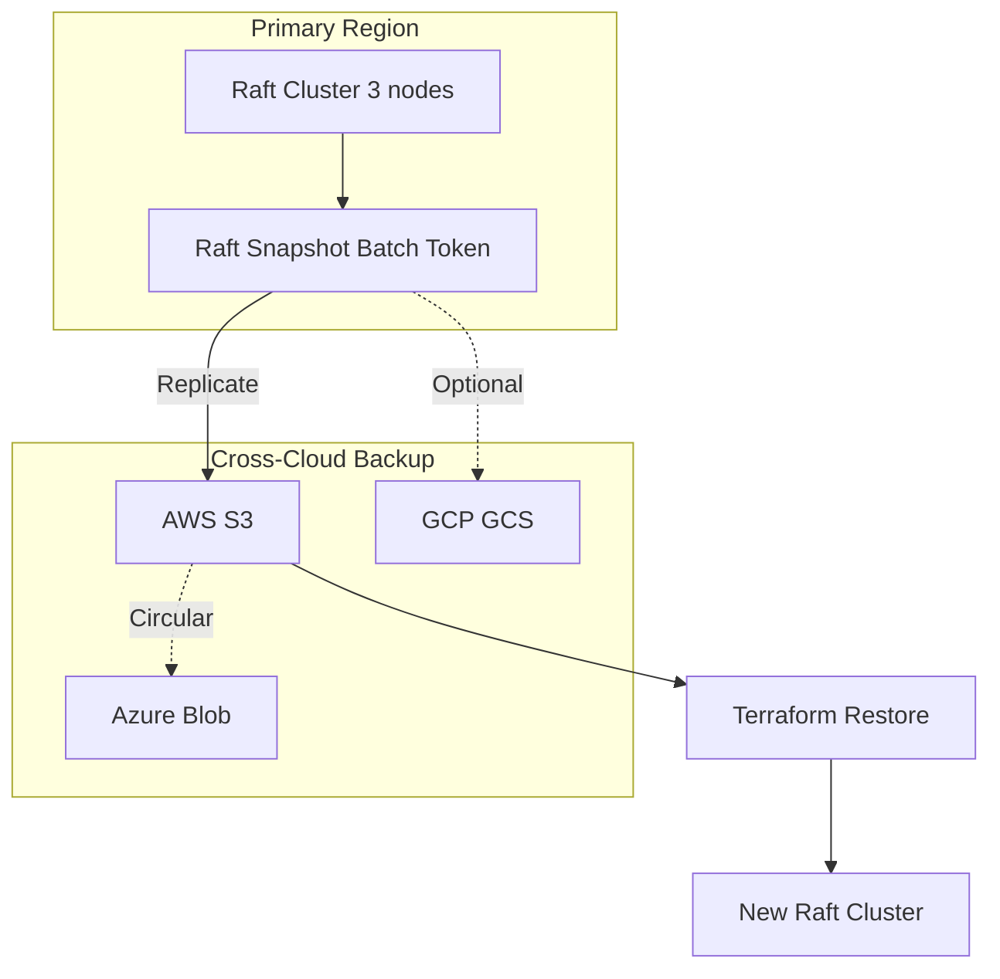
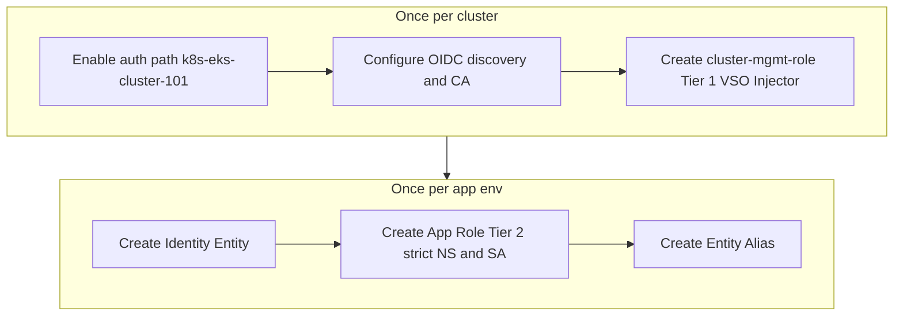

# Vault Enterprise Hub — Architectural Specification

**Source of truth** for the Vault Hub: a centralized security broker for **150+ clusters** and **100+ accounts** using open-source components only.

---

## Table of Contents

1. [Overview & Design Philosophy](#1-overview--design-philosophy)
2. [Architecture](#2-architecture)
3. [Infrastructure Standards](#3-infrastructure-standards)
4. [Identity Metadata Standard](#4-identity-metadata-standard)
5. [Policy Specification](#5-policy-specification)
6. [Multi-Tenant Authentication](#6-multi-tenant-authentication)
7. [Human Governance & SSO](#7-human-governance--sso)
8. [Disaster Recovery](#8-disaster-recovery)
9. [Standard Operating Procedures](#9-standard-operating-procedures)
10. [Security Guardrails & Reference](#10-security-guardrails--reference)

---

## 1. Overview & Design Philosophy

The Vault Hub is a **centralized security broker** in a hub-and-spoke model. Three principles:

| Principle | Description |
|-----------|-------------|
| **Identity-First** | Every request is tied to a cryptographically verified Identity Entity. |
| **Policy Minimalism** | A single "Universal Policy" replaces hundreds of static policy files. |
| **Zero-Static Credentials** | No master keys or long-lived secrets for cloud or cluster access. |

---

## 2. Architecture

### 2.1 High-Level: Hub-and-Spoke



### 2.2 Identity & Policy Resolution Flow



### 2.3 Authentication Flows (K8s + OIDC)



### 2.4 Disaster Recovery & Backup



### 2.5 Cluster & Application Onboarding Flow



---

## 3. Infrastructure Standards

### 3.1 High Availability (HA)

| Item | Standard |
|------|----------|
| **Backend** | HashiCorp Raft (integrated storage) |
| **Node count** | 3 replicas (quorum of 2) |
| **Auto-unseal** | Cloud KMS (e.g. AWS KMS via IRSA) for zero-touch recovery after pod restarts or regional failover |

### 3.2 Resilience & Performance

| Item | Standard |
|------|----------|
| **Raft storage** | High-performance `gp3` SSDs; throughput tuned to avoid election timeouts under 150+ clusters |
| **Audit** | Dual-path: `stdout` (SIEM) and local `backup.log` on a separate 50Gi PVC to avoid panic shutdowns if network logging fails |

---

## 4. Identity Metadata Standard

Security logic is driven by **identity metadata**. After authentication, Vault stamps the client (pod or user) with four mandatory tags:

| Metadata Key | Description | Example |
|--------------|-------------|---------|
| `ou` | Organizational unit (top-level mount) | `test1` |
| `bu` | Business unit (L2 folder) | `finance` |
| `app_name` | Unique application ID | `payment-api` |
| `env` | Deployment lifecycle | `prod` |

Path layout: `{{ou}}-ou/data/{{bu}}/{{app_name}}/{{env}}/*`

---

## 5. Policy Specification

### 5.1 Universal Policy (Single Dynamic Template)

One policy covers the vast majority of applications. Paths are derived from the requester’s identity metadata.

**File: `universal-nested-policy.hcl`**

```hcl
# 1. Application-specific KV path
path "{{identity.entity.metadata.ou}}-ou/data/{{identity.entity.metadata.bu}}/{{identity.entity.metadata.app_name}}/{{identity.entity.metadata.env}}/*" {
  capabilities = ["read", "list"]
}

# 2. Shared/common secrets for the BU+env
path "{{identity.entity.metadata.ou}}-ou/data/{{identity.entity.metadata.bu}}/shared/{{identity.entity.metadata.env}}/*" {
  capabilities = ["read", "list"]
}

# 3. Self-discovery: read own entity metadata
path "identity/entity/id/{{identity.entity.id}}" {
  capabilities = ["read"]
}
```

**Apply once (no per-app policy files):**

```bash
vault policy write universal-nested-policy universal-nested-policy.hcl
```

**Resolution example:** Role metadata `ou=test1`, `bu=finance`, `app_name=payment-api`, `env=prod` → allowed path `test1-ou/data/finance/payment-api/prod/*`. Access to `test1-ou/data/retail/oms/prod/*` is denied.

Isolation: metadata is set on the **auth role** at onboarding; an app cannot change it to access another team’s path.

### 5.2 Break-Glass: Hub Operator Policy

For SREs who manage auth mounts and identity (not secret data):

**File: `hub-operator-policy.hcl`**

```hcl
# Auth methods (cluster onboarding)
path "sys/auth/k8s-*" {
  capabilities = ["create", "read", "update", "delete", "sudo"]
}

# Identity metadata
path "identity/*" {
  capabilities = ["create", "read", "update", "delete"]
}

# KV mount metadata only (no secret read)
path "*-ou/metadata/*" {
  capabilities = ["list", "read"]
}
```

---

## 6. Multi-Tenant Authentication

### 6.1 Tiered Kubernetes Authentication

| Tier | Purpose | Binding | Use case |
|------|---------|---------|----------|
| **Management (Tier 1)** | VSO / Injector | Wildcard namespaces `*:*`, infrastructure metadata | Cluster-wide operator |
| **Application (Tier 2)** | Microservices | Exact `Namespace` + `ServiceAccount` | Per-app least privilege |

### 6.2 Keyless Multi-Cloud Federation

- Vault uses **Workload Identity Federation (WIF)** and OIDC to identify itself to AWS/Azure/GCP (no static IAM keys).
- It issues **short-lived dynamic credentials** (STS tokens / service principals) for Terraform or other provisioning.

---

## 7. Human Governance & SSO

### 7.1 OIDC Flow

1. User chooses “Login with OIDC” in the Vault UI.
2. Redirect to company IdP (e.g. Azure AD).
3. IdP returns a JWT (email + group memberships).
4. Vault maps SSO groups to **internal Vault groups** (with metadata).

### 7.2 Group Standard

- **Access method:** OIDC only; no local Vault users.
- **Grouping:** Humans mapped via **external identity groups** (group alias from IdP group ID to Vault group).
- **Metadata:** Groups carry `ou`, `bu`, `env` so the same **universal policy** applies to humans and apps (symmetric access).

**Create a team group and alias (example):**

```bash
GROUP_ID=$(vault write -format=json identity/group name="finance-developers" \
    type="internal" \
    metadata="ou=test1,bu=finance,env=prod" \
    policies="universal-nested-policy" \
    | jq -r '.data.id')

vault write identity/group-alias name="{{SSO_GROUP_OBJECT_ID}}" \
    mount_accessor=$(vault auth list -format=json | jq -r '."oidc/".accessor') \
    canonical_id=$GROUP_ID
```

### 7.3 SRE Break-Glass Group

```bash
vault write identity/group name="vault-admins" \
    type="internal" \
    policies="hub-operator-policy" \
    metadata="ou=system,bu=sre"
```

---

## 8. Disaster Recovery

| Metric | Target |
|--------|--------|
| **RPO** | 15 minutes (high-frequency Raft snapshots) |
| **RTO** | &lt; 30 minutes (automated Terraform restoration) |
| **Snapshot** | Batch tokens to avoid Raft write pressure; verify against `raft_applied_index` |
| **Replication** | Snapshots from one cloud replicated to an immutable bucket in another (e.g. AWS → Azure Blob) |

---

## 9. Standard Operating Procedures

### 9.1 Onboarding a New Kubernetes Cluster

**1. Enable cluster auth path (one per cluster):**

```bash
vault auth enable -path=k8s-eks-cluster-101 jwt
```

**2. Configure trust (OIDC discovery + CA):**

```bash
vault write auth/k8s-eks-cluster-101/config \
    oidc_discovery_url="https://oidc.eks.us-east-1.amazonaws.com/id/EXAMPLEDATA" \
    kubernetes_ca_cert=@ca.crt
```

**3. Create cluster management role (Tier 1):**

```bash
vault write auth/k8s-eks-cluster-101/role/cluster-mgmt-role \
    role_type="jwt" \
    bound_claims='{"sub": "system:serviceaccount:*:*"}' \
    user_claim="sub" \
    metadata="ou=test1,bu=infrastructure,app_name=cluster-101-mgmt" \
    token_policies="universal-nested-policy" \
    token_ttl="24h"
```

### 9.2 Onboarding an Application

**1. Create identity entity:**

```bash
ENTITY_ID=$(vault write -format=json identity/entity name="payment-api" \
    metadata="app_name=payment-api" \
    | jq -r '.data.id')
```

**2. Create application role (Tier 2, strict binding):**

```bash
vault write auth/k8s-eks-cluster-101/role/payment-api-prod \
    role_type="jwt" \
    bound_audiences="https://vault.internal" \
    user_claim="sub" \
    bound_claims='{"sub": "system:serviceaccount:finance-prod:payment-api-sa"}' \
    metadata="ou=test1,bu=finance,app_name=payment-api,env=prod" \
    token_policies="universal-nested-policy" \
    token_ttl="1h"
```

**3. Create entity alias:**

```bash
vault write identity/entity-alias name="system:serviceaccount:finance-prod:payment-api-sa" \
    canonical_id=$ENTITY_ID \
    mount_accessor=$(vault auth list -format=json | jq -r '."k8s-eks-cluster-101/".accessor')
```

---

## 10. Security Guardrails & Reference

### 10.1 Guardrails

- **Metadata immutability:** Metadata is defined at the **auth role** (or group) level; only Vault admins can change it, so apps cannot “hop” to another team’s path.
- **Path convention:** Every KV mount name must end with `-ou` (e.g. `test1-ou`) to align with the universal policy.

### 10.2 Onboarding Summary

| Component | Level | Frequency | Purpose |
|-----------|--------|-----------|---------|
| Auth mount | Cluster | Once per cluster | Infrastructure trust |
| Cluster role | Cluster | Once per cluster | Management (VSO/Injector) |
| App role | App | Once per app/env | Least-privilege app access |
| Entity alias | App | Once per cluster | Identity continuity |

### 10.3 Human Access Summary

| Feature | Standard |
|---------|----------|
| Auth type | OIDC (SSO) |
| Identity entity | Created on first login |
| Group mapping | External group aliases (IdP group ID → Vault group) |
| Policy assignment | Via groups, not per user |
| Metadata | `ou`, `bu`, `env` on group metadata |

### 10.4 OIDC Config (IdP Front Door)

```bash
vault auth enable oidc
vault write auth/oidc/config \
    oidc_discovery_url="https://login.microsoftonline.com/{{tenant_id}}/v2.0" \
    oidc_client_id="{{client_id}}" \
    oidc_client_secret="{{client_secret}}" \
    default_role="default-user"

vault write auth/oidc/role/default-user \
    user_claim="email" \
    allowed_redirect_uris="https://vault.company.com/ui/vault/auth/oidc/oidc/callback" \
    groups_claim="groups" \
    oidc_scopes="openid,profile,email" \
    token_policies="default"
```

---

## Summary

- **Vault Hub** = central security broker; all access is identity-first, with a single universal policy and no static cloud credentials.
- **Machines:** JWT auth per cluster (Tier 1 for operators, Tier 2 for apps); metadata on roles drives path resolution.
- **Humans:** OIDC only; groups carry the same metadata so they get the same path-based access as the apps they support.
- **Operations:** One auth mount and cluster role per cluster; one entity, app role, and alias per app/env; Raft HA, KMS unseal, dual audit, and cross-cloud snapshot replication for DR.

For automation (Terraform) of policies, OIDC config, and JWT auth mounts, see the platform runbooks or request the Terraform modules from the platform team.
