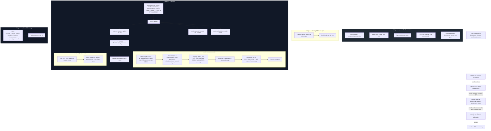

## Platform Component Manager (RC → Promote → Rollback)

The **Platform Component Manager** workflow is the release automation “landing zone” for the platform monorepo.  
It owns the full lifecycle for **actions** and **reusable workflows**:

- **RCs on `develop`** (pre‑release candidates)
- **Promotions on `main`** (stable release)
- **Rollbacks** to any previous stable version
- **SemVer safety**, **tag pruning**, **environments**, and **auto‑changelog**

The workflow file is `platform/.github/workflows/platform-component-manager.yml`.

### Summary checklist (perfection)

- [x] **Concurrency:** Grouped by `component_path` (`concurrency.group: pcm-${{ inputs.component_path }}`) to prevent tag collisions when multiple runs are queued.
- [x] **Rollback:** Performs a physical file sync: `.github/workflows/` is restored from the target tag on `main` so the branch and tag stay consistent.
- [x] **OIDC / tokens:** Documentation and standard require GitHub App installation tokens for same-repo push; PATs are deprecated for this use.
- [x] **Linting:** ShellCheck uses the runner’s pre-installed binary (no `sudo`); Bandit runs via `tj-actions/bandit` (Docker).

---

### Pipeline flow (Mermaid)

---

## What this manages in the platform

- **Actions:**  
  `actions/<name>/` (e.g. `actions/prbot`, `actions/git-path-filter`)  
  - `action.yml` / `action.yaml` is validated for basic structure.
  - Releases are just tags on the **main** branch; the action code stays in the monorepo.

- **Reusable workflows:**  
  `workflows/<name>/` or `platform/workflows/<name>/`  
  - Source of truth lives under `workflows/` or `platform/workflows/`.  
  - On **promote**, the workflow copies that folder’s `.yml` files into `.github/workflows/` and commits them; GitHub only runs workflows from `.github/workflows/`.  

Together, this gives you a single release pipeline for:

- **Platform actions** (under `actions/`)
- **Platform workflows** (under `workflows/` / `platform/workflows/`)

Any path **`actions/<name>`** or **`workflows/<name>`** that exists and passes validation can be released (RC → promote) or rolled back; there is no hardcoded list of components.

---

## Jobs and environments

### validate job

- Runs on **current ref** (branch you dispatch from).
- Responsibilities:
  - **Path check:** `component_path` must be an existing folder.
  - **Type detection:**  
    - If `component_path` starts with `workflows/` → `type = workflow`.  
    - Otherwise → `type = action`.
  - **RC gate for promote:**  
    - For `mode = promote`, require tag `path/VER-rc` to exist on `develop`.  
    - This enforces the “RC before promotion” discipline.
  - **SemVer gate for promote:**  
    - Enumerate all tags matching `path/[0-9]*`.  
    - Extract just the numeric versions, `sort -V`, and find the **latest existing** version.  
    - If the requested `version` would be **lower** than the latest, the workflow fails with a **version regression** error.
  - **Action metadata validation (actions only):**
    - Ensure `action.yml` or `action.yaml` exists in the component folder.
    - Check that it has at least `name:` and `runs:` at top level.
  - **Checkov (workflows only):**
    - When `type = workflow`, runs the official [bridgecrewio/checkov-action](https://github.com/bridgecrewio/checkov-action) (`@v12`) with `framework: github_actions` on the **component path** only.
    - Enforces security and best-practice rules (e.g. CKV_GHA_*: unsecure commands, shell injection, permissions).
    - Release is blocked if any check fails.

### security-spvs job (Stage 2 – full platform repo, OWASP SPVS aligned)

- Runs after **validate** passes. Validates the **entire platform repository** against SPVS-aligned security standards before any release runs.
- **Checkov – GitHub Actions (entire repo):** Runs Checkov with `framework: github_actions` on directory `.` (all workflow YAML under `.github/workflows/` and any workflow files in the repo). Fails the job if any policy check fails.
- **Shell scripts – shellcheck:** Finds all `*.sh` files (excluding `.git/`), runs `shellcheck --external-sources` on each. Fails the job if any script fails. Aligns with SPVS pipeline security (script injection, quoting, best practices).
- **Permissions:** `contents: read`.
- **Execute** runs only if **validate**, **security-spvs**, and **security-gate** succeed.

### security-gate job (Stage 2b – SPVS Native Security Gate, component-scoped)

- Inlined in the same workflow (no separate reusable file). Runs **ShellCheck** (native: `apt-get install shellcheck` + `find` over component path), **Bandit** (Python) on the component path, **permission audit** (grep for `write-all` in `.github/workflows/`), and **attest build provenance** for the component.
- **No third-party ShellCheck action:** ShellCheck is run via system install and `find "$COMPONENT_PATH"`.
- Uses workflow_dispatch input `component_path`; Python 3.11 for Bandit.
- **Execute** runs only if validate, security-spvs, and security-gate all succeed.

### execute job (Stage 3)

- Runs on:
  - `develop` when `mode = rc`.
  - `main` when `mode = promote` or `rollback`.
- Uses GitHub **environments**:
  - `rc` → `staging` environment, URL → `develop` branch.  
  - `promote` / `rollback` → `production` environment, URL → `main` branch.
- Permissions: `contents: write`, `id-token: write`, `attestations: write` (for provenance).
- After release: **Build provenance** is generated with `actions/attest-build-provenance@v2` (subject: workspace at release; subject-name: `release:<component_path>@<version>`).
- Token:
  - Uses `GITHUB_TOKEN` by default. Set repo secret `COMMIT_TOKEN` only when branch protection blocks the default token (e.g. push to protected `main`).
  - **Prefer a GitHub App** over a PAT for `COMMIT_TOKEN`: short-lived, scoped to repo contents. See **Security and tokens** below.

What it does, per mode:

- **mode = rc (develop branch)**
  - Create or update `path/VER-rc` on `develop`.
  - Push with `--force`.
  - This is the “candidate” that must pass tests before promotion.

- **mode = promote (main branch)**
  - **Self-healing RC check:**
    - Resolve `path/VER-rc`.  
    - Ensure its commit **matches `main` HEAD**; if not, fail the promotion.  
    - This guarantees you only promote code that was really tested as that RC.
  - **Workflow sync (type = workflow):**
    - Copy `workflows/<name>/*.yml` (or `platform/workflows/<name>`) into `.github/workflows/`.
    - Commit and push to `main`. This new commit becomes the tag target.
  - **Tagging:**
    - Determine `PREV_TAG` (latest `path/[0-9]*` before creating this one).  
    - Create full tag `path/VER`.  
    - Move stable tag `path/vMAJOR` to the same commit, pushed with `--force`.
  - **Pruning:**
    - List all tags `path/[0-9]*` sorted by version descending.  
    - Keep the **newest 5**; delete any older tags locally and on `origin`.  
    - This implements a rolling window of 5 historical versions per component.
  - **Auto‑changelog:**
    - If `PREV_TAG` exists and differs from the new `path/VER`, run:  
      `git log --oneline --pretty=format:"* %s (%h)" PREV_TAG..HEAD -- path`  
    - Append the result as a Markdown section to `$GITHUB_STEP_SUMMARY` for quick release notes.

- **mode = rollback (main branch)**
  - Verify the requested `FULL_TAG = path/VER` exists.  
  - **State reversion (workflows only):** Restore `.github/workflows/` from the target tag (`git checkout FULL_TAG -- .github/workflows/`), commit and push to `main`, so the working tree matches the tag (no split-brain).
  - Move stable tag `path/vMAJOR` to point at that full tag’s commit.  
  - Push stable tag with `--force`.

### audit job (Stage 4)

- Always runs (`if: always()`).
- Appends a short summary to `$GITHUB_STEP_SUMMARY`:
  - `component_path`, `mode`, `needs.execute.result`.  
  - (For promotes) the auto‑changelog section from `execute`.

---

## Input contract

| Input | Required | Description |
|-------|----------|-------------|
| `component_path` | Yes | Platform component path: `actions/<name>` or `workflows/<name>` / `platform/workflows/<name>`. Must be a folder. |
| `version` | Yes | Semantic version (e.g. `1.2.0`). For `rc`, it is the RC version; for `promote`, the released version; for `rollback`, the version to point the stable tag at. |
| `mode` | Yes | `rc`, `promote`, or `rollback`. |

---

## Tag model (after refactor)

For a component `actions/my-action` and `version = 1.2.0`:

- **RC tag (develop):**  
  - `actions/my-action/1.2.0-rc`
- **Full (stable) tag (main):**  
  - `actions/my-action/1.2.0`
- **Major alias (stable pointer, main):**  
  - `actions/my-action/v1`

The workflow enforces:

- No promotion without a matching `*-rc` tag.
- No promotion that regresses relative to the latest existing full tag.
- At most **5 full-version tags** per component prefix (older ones are pruned).

---

## How this fits into the platform

At the platform level, this workflow provides:

- A **single, opinionated release flow** for:
  - Platform GitHub **actions** (in `actions/`).
  - Platform GitHub **workflows** (in `workflows/` / `platform/workflows/` → `.github/workflows/`).
- **Clear lifecycle states:**
  - `develop` + RC tags → staging.
  - `main` + full tags → production.
  - **Guardrails and self‑healing:**
  - SemVer monotonicity.
  - RC–main commit parity check.
  - Basic action metadata validation.
  - **Full-repo SPVS security** (Stage 2): Checkov for all workflows, shellcheck for all shell scripts; release blocked until both pass.
  - Tag pruning and auto‑changelog for observability.

Consumers across the platform can then **standardize on tag patterns** like `actions/my-action/1.2.0` or `actions/my-action/v1` and rely on this workflow to keep those refs correct, safe, and tidy over time.

---

## Security and tokens

- **Input validation (shell-injection proof)**  
  `component_path` and `version` are validated with strict allowlists before any use in `cp`, `git tag`, or `git push`. Allowed: `component_path` = `actions/<name>` or `workflows/<name>` (alphanumeric, `_`, `.`, `-` only); `version` = SemVer `X.Y.Z`. Tag deletion only affects tags matching the same pattern.

- **Least-privilege permissions**  
  - `validate`: `contents: read`.  
  - `execute`: `contents: write`, `id-token: write`, `attestations: write`.  
  - `audit`: `contents: read`.

- **Token governance (required for protected branches)**  
  GitHub does not issue OIDC tokens for pushing to the same repo; you need a token with `contents: write`.  
  - **GitHub App installation token (required)** – For any workflow that pushes to protected branches (e.g. `main`), use a **GitHub App** with repository permission **Contents: Read and write**, install it on the repo, and supply the **installation token** as `COMMIT_TOKEN`. Installation tokens are short-lived, scoped to the App (no personal user account), and support fine-grained permissions. Do not use a PAT for production release workflows.  
  - **`GITHUB_TOKEN`** – Use only when branch protection explicitly allows the Actions app to push (e.g. “Allow specified actors” including `github-actions`).  
  - **PAT (deprecated for this use)** – If a PAT is used temporarily, it must be a fine-grained PAT with minimal scope (repository contents: read and write only). Rotate regularly and replace with a GitHub App as soon as possible’s permissions.  

