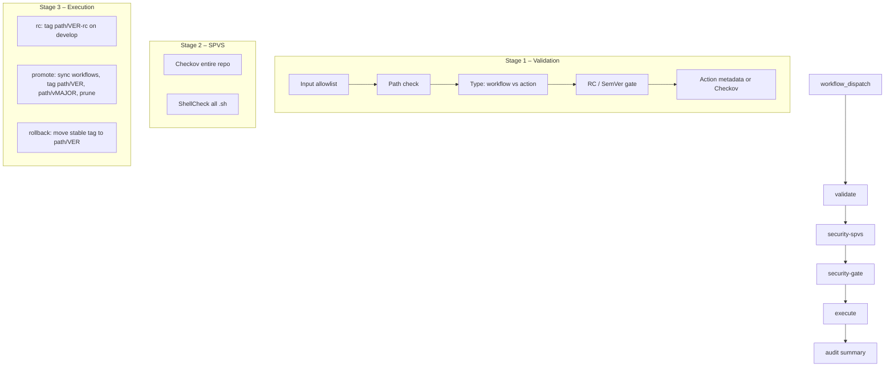

# Platform – reusable actions and container images

Single folder for **custom reusable actions** and **container images** used by this repo and by application teams. All builds use **Buildah or Podman only** (no Docker). No CodeQL; compliance is Trivy on images.

**Contents:** [Layout](#layout) · [Actions](#reusable-actions) · [Images](#container-images) · [Workflows](#workflows) · [Releasing](#releasing-tagged-versions) · [Handbook](#handbook) (getting started, architecture, rollback, troubleshooting, CLI, security).

**Where to find what:** Standards and process: [devsecops-spvs-standard.md](devsecops-spvs-standard.md), [owasp-spvs.md](owasp-spvs.md), [SECURITY.md](SECURITY.md). Release flow: [platform-component-manager.md](platform-component-manager.md). Naming and conventions: [.github/naming.md](.github/naming.md), [rules-writing-scripts-actions-workflows.md](rules-writing-scripts-actions-workflows.md). Compliance: [compliance.md](compliance.md).

---

## Layout

| Path | Purpose |
|------|--------|
| **actions/** | Composite reusable actions (use from workflows with `uses: org/repo/platform/actions/NAME@ref`) |
| **images/** | Containerfiles and build context for images (Buildah/Podman) |
| **workflows/** | Workflow definitions (run from `.github/workflows/`; paths reference `platform/`) |
| **act/** | Local testing with [act](https://github.com/nektos/act): run workflows from repo root via `./platform/act/run.sh` |
| **CHANGELOG.md** | Changelog for actions and images |

---

## Reusable actions

### owasp-dependency-check

**Path:** `platform/actions/owasp-dependency-check/`

Runs OWASP Dependency-Check using a pre-built UBI9 image. Requires **Podman** on the runner (e.g. ARC runner pod).

**Use from this repo:**
```yaml
- uses: ./platform/actions/owasp-dependency-check
  with:
    project: my-app
    path: .
    format: HTML
```

**Use from another repo (application teams):** Pin to a release tag for stability.
```yaml
- uses: YOUR_ORG/IDP/platform/actions/owasp-dependency-check@v1.0.0   # or @main for latest
  with:
    project: my-app
    path: .
    format: HTML
    image: ghcr.io/YOUR_ORG/IDP/owasp-dependency-check:latest
```

See [Releasing](#releasing-tagged-versions) for how we publish versions so app teams can use `@v1.x.x`.

### All platform actions

| Action | Path | Purpose |
|--------|------|---------|
| **owasp-dependency-check** | `platform/actions/owasp-dependency-check/` | OWASP Dependency-Check in CI (Podman, UBI9 image). |
| **git-path-filter** | `platform/actions/git-path-filter/` | Detect file changes between refs; YAML pattern groups; JSON output for monorepo path filters. |
| **drift-auditor** | `platform/actions/drift-auditor/` | Terraform drift: parallel `terraform plan` (S3 backend), single "Infrastructure Drift Report" Issue per repo. |
| **prbot** | `platform/actions/prbot/` | Create or reuse a PR (same or another repo). Idempotent. |
| **janitor-bot** | `platform/actions/janitor-bot/` | Scan/cleanup stale branches, PRs, artifacts, packages (repo/org/topic). Config via env. |

Details: see `readme.md` in each action folder.

### Adding a new action

1. Create **`platform/actions/<name>/`** with **`action.yml`** (or `action.yaml`) and a **`readme.md`** that describes purpose, inputs, outputs, and usage.
2. Add any scripts (e.g. Python) that the action calls; follow [rules-writing-scripts-actions-workflows.md](rules-writing-scripts-actions-workflows.md) and [devsecops-spvs-standard.md](devsecops-spvs-standard.md).
3. Run **Platform Component Manager** with `component_path=actions/<name>`, `version` (e.g. `1.0.0`), `mode=rc` on **develop**, then merge to main and run with `mode=promote` on **main**. Any path **`actions/<name>`** that exists and passes validation can be released or rolled back.

---

## Container images

<!-- IMAGES_TABLE_START -->
| Image | Path | Base | Purpose |
|-------|------|------|---------|
| **owasp-dependency-check** | `platform/images/owasp-dependency-check/` | UBI9 | OWASP Dependency-Check CLI (nightly build; compliance pulls and scans only). |
| **gha-runner-scale-set-runner** | `platform/images/gha-runner-scale-set-runner/` | UBI9 | ARC self-hosted runner with rootless Podman/Buildah. |
| **gha-runner-scale-set-controller** | `platform/images/gha-runner-scale-set-controller/` | UBI9 minimal | ARC controller (binaries copied from upstream; no distroless). |
<!-- IMAGES_TABLE_END -->

### Adding a new image

1. Create **`platform/images/<id>/`** with at least a **Containerfile** (and any scripts it needs).
2. Add optional **`platform/images/<id>/image-info.yaml`** with `name`, `base`, `purpose` for the README table.
3. Add an entry to **`platform/images/images.yaml`** (`id`, `pull_only`, optional `build_args`). The compliance workflow and README table pick it up automatically.

**README tables:** The actions list, images table, and compliance badge in this readme can be updated by **`scripts/update_readme.py`** (e.g. after adding actions/images or to set the badge org/repo). Run it when maintaining this file.

### Build tags

- **owasp-dependency-check:** Built by nightly; compliance pulls and scans.
- **gha-runner-scale-set-runner** / **gha-runner-scale-set-controller:** Built in compliance or locally; tag e.g. `ghcr.io/org/<name>:latest`.

### Compliance status

<!-- COMPLIANCE_TABLE_START -->
[](https://github.com/YOUR_ORG/YOUR_REPO/actions/workflows/compliance.yml)
<!-- Replace YOUR_ORG/YOUR_REPO with your GitHub org and repo (e.g. scripts/update_readme.py --repo org/repo). -->

Full table: [compliance.md](compliance.md)
<!-- COMPLIANCE_TABLE_END -->

Workflow **Compliance** (`.github/workflows/compliance.yml`): first Sunday of month + manual. Trivy config+fs per image; build+push only when Critical=0; updates this table. See [Compliance workflow](#compliance-workflow) below.

---

## Workflows

Workflows that **run** on GitHub live in **`.github/workflows/`** at the repo root. The **canonical source** for many of them is under **`platform/workflows/`**; the Platform Component Manager (promote mode) copies workflow files from `platform/workflows/<name>/` into `.github/workflows/` so they execute. Only files in `.github/workflows/` are run by GitHub.

| Workflow | Source | Purpose |
|----------|--------|---------|
| **Platform Component Manager** | `.github/workflows/platform-component-manager.yml` | RC → promote → rollback for actions/workflows; validate, security-spvs, security-gate, execute, audit. |
| **Compliance** | `platform/workflows/compliance/` | Trivy per image; build+push when Critical=0; updates compliance table. |
| **Dependency-Check UBI9 (nightly)** | `platform/workflows/dependency-check-nightly/` | Build and push owasp-dependency-check image to GHCR. |
| **nodejs-app** | `platform/workflows/nodejs-app/` | Reusable Node.js app workflow. |
| **terraform** / **terraform-refresh-daily** | `platform/workflows/terraform/`, `terraform-refresh-daily/` | Terraform plan/apply; daily refresh. |
| **drift-check** | `platform/workflows/drift-check/` | Drift detection (uses drift-auditor action). |

Reusable workflows are called with `uses: org/repo/.github/workflows/name.yml@ref`.

**Reference vs released:** Workflows under `platform/workflows/compliance/` and `dependency-check-nightly/` are **published** to `.github/workflows/` (by repo setup or PCM). Others (e.g. `nodejs-app`, `drift-check`) are **reference** or released via PCM when you promote them.

### Adding a new reusable workflow

1. Create **`platform/workflows/<name>/`** with your workflow `.yml` and a **`readme.md`** that describes purpose, inputs, and when it runs.
2. Run **Platform Component Manager** with `component_path=workflows/<name>`, `version` (e.g. `1.0.0`), `mode=rc` on **develop**, then merge to main and run with `mode=promote` on **main**. Promote copies the workflow into `.github/workflows/` and creates tags so other repos can call it with `uses: org/repo/.github/workflows/<name>.yml@v1`.
3. Any path **`actions/<name>`** or **`workflows/<name>`** that exists and passes validation can be released (RC → promote) or rolled back.

---

## Releasing tagged versions

- **Actions/workflows:** Use **Platform Component Manager** (Actions → Run workflow). `component_path`: e.g. `actions/owasp-dependency-check` or `workflows/nodejs-app`. `version`: e.g. `1.2.0`. `mode`: `rc` (on develop) then `promote` (on main), or `rollback`. See [platform-component-manager.md](platform-component-manager.md) for full detail.

### Usage for application teams

- **Stable:** `uses: YOUR_ORG/IDP/platform/actions/owasp-dependency-check@1.0.0`
- **RC:** `uses: YOUR_ORG/IDP/platform/actions/owasp-dependency-check@1.0.0-rc`

From another repo, pass the **image** input (e.g. `ghcr.io/YOUR_ORG/IDP/owasp-dependency-check:latest`).

---

## Handbook

### Getting started

1. Create or update the component under `platform/actions/<name>` or `platform/workflows/<name>`.
2. **RC on develop:** Actions → Platform Component Manager → `component_path`, `version` (e.g. `1.2.0`), `mode`: `rc`.
3. Merge to `main`.
4. **Promote on main:** Same workflow, same `component_path` and `version`, `mode`: `promote`.
5. Security gates (validate, Checkov, ShellCheck, Bandit, attestation) must pass before promote.

### Architecture – Platform Component Manager

Four stages: **validate** → **security-spvs** → **security-gate** → **execute**; **audit** always runs.



### Compliance workflow

- **Runs:** First Sunday of month (cron) or manual (Actions → Compliance). Inputs: `image_to_build` (ALL or single name), `registry`, `pull_registry`.
- **Steps:** Discovery (image folders with Containerfile) → matrix per image (max 4): Trivy config+fs → if Critical=0, build (Buildah/Podman) and push; artifacts uploaded. Post: update README/compliance table.
- **Standards:** [owasp-spvs.md](owasp-spvs.md).

### Rollback

To point the stable major tag (e.g. `actions/my-action/v1`) at an older version (e.g. `1.1.0`): run Platform Component Manager on `main` with `component_path`, `version` = target (e.g. `1.1.0`), `mode`: `rollback`. The full tag must already exist. Rollback only moves the major alias; it does not delete newer full tags.

### Troubleshooting

| Issue | Fix |
|-------|-----|
| "RC tag required for promote" | Create RC on develop with same path/version; merge to main; then promote. |
| "Version regression" | Use a version higher than latest, or use rollback to move stable to an older version. |
| Checkov / ShellCheck fail | Fix reported findings in workflow YAML or `.sh`; re-run. |
| "Broken link" (validate job) | Fix or add the linked file; paths resolved from repo root. |

### CLI (gh)

```bash
gh run list --workflow "Platform Component Manager" --limit 10
gh workflow run "Platform Component Manager" --ref develop -f component_path=workflows/nodejs-app -f version=1.0.0 -f mode=rc
gh workflow run "Platform Component Manager" --ref main -f component_path=workflows/nodejs-app -f version=1.0.0 -f mode=promote
gh workflow run "Platform Component Manager" --ref main -f component_path=workflows/nodejs-app -f version=0.9.0 -f mode=rollback
git tag -l "workflows/nodejs-app/*"
```

Local testing: `./platform/act/run.sh` (see [act/readme.md](act/readme.md)).

### Security and standards (OWASP SPVS)

- **Secure coding (summary):** Python: `subprocess` list-based, no `shell=True`/`eval`/`exec`; path validation. Shell: `set -euo pipefail`, `"$VAR"`, no `${{ }}` in `run:` (use `env:`). Actions: explicit `permissions:` per job, no anchors; attestation for release.
- **Full standard:** [devsecops-spvs-standard.md](devsecops-spvs-standard.md). **SPVS overview:** [owasp-spvs.md](owasp-spvs.md). **Policy:** [SECURITY.md](SECURITY.md).
